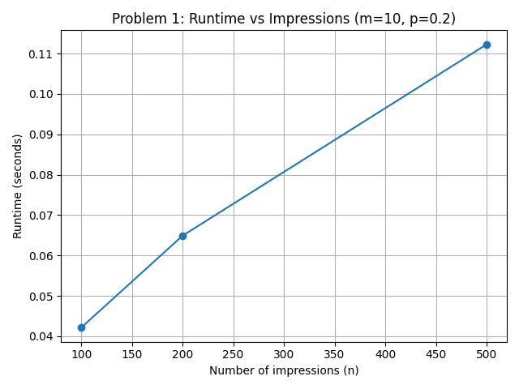
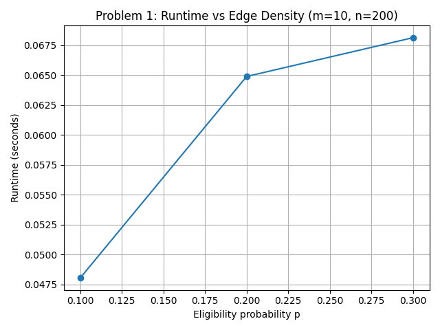
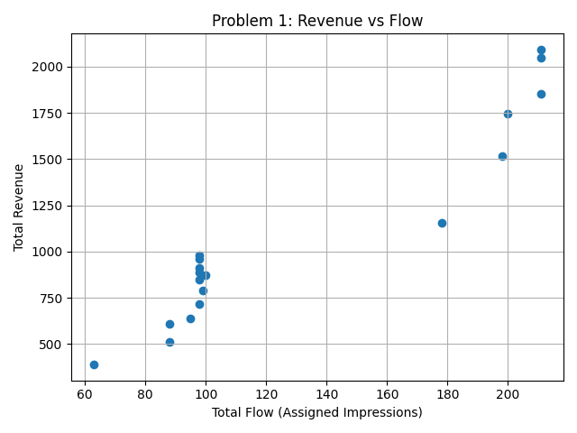
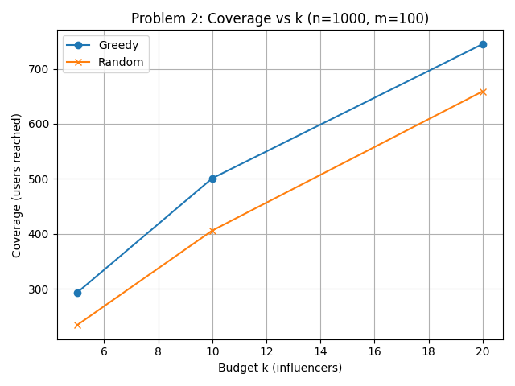
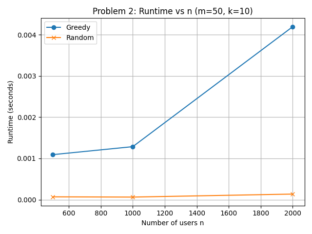

# Algorithms Project — Network Flow & NP-Hard Optimization

**University of Florida — CISE Department**  
**Course: Algorithm Analysis (AoA)**

This repository contains complete implementations, polynomial reductions, experiments, and visualizations for two algorithmic problems required in the course project.

---

## 📌 Problem Summary

### 🔷 Problem 1 — Ad Assignment Using Network Flow (Min-Cost Max-Flow)

A real-world advertisement assignment problem reduced to a **min-cost max-flow** graph problem:

- **Advertisers have budgets** → capacity constraints  
- **Impressions assigned once** → unit capacity  
- **Each advertiser–impression pair yields revenue**  
- **Goal: maximize revenue** (modeled as minimizing negative cost)

This satisfies the project requirement of solving a problem reducible to Network Flow.

---

### 🔷 Problem 2 — Influencer Selection Using Greedy Approximation (NP-Hard)

**Given:**
- A universe of users  
- A set of influencers, each with a set of followers  
- A budget *k* for number of influencers to choose  

**Goal:** Maximize unique users reached.

We provide a **polynomial reduction from Set Cover → Influencer Selection**, proving the problem is **NP-Hard**, then implement the classical **(1 − 1/e)** greedy approximation algorithm.

---

## 📁 Folder Structure

```
project_root/
│
├── README.md
├── .gitignore
│
├── output/
│   ├── problem1/          # Plots + CSV for Problem 1
│   └── problem2/          # Plots + CSV for Problem 2
│
├── problem1/
│   ├── ad_assignment.py
│   ├── generate_data.py
│   ├── min_cost_max_flow.py
│   ├── run_problem1.py
│   └── test1.py
│
└── problem2/
    ├── generate_influencer_data.py
    ├── influencer_selection.py
    ├── run_problem2.py
    └── test.py
```

---

## ▶️ Running the Project

### ⭐ Recommended: Use module mode to avoid import errors

**Run Problem 1 experiments:**
```bash
python -m problem1.run_problem1
```

**Run Problem 2 experiments:**
```bash
python -m problem2.run_problem2
```

---

## 🛠 Installation

**1. Create virtual environment:**
```bash
python -m venv venv
```

**2. Activate environment:**

*Windows:*
```bash
venv\Scripts\activate
```

*Mac/Linux:*
```bash
source venv/bin/activate
```

**3. Install dependencies:**
```bash
pip install matplotlib
```

---

## 🧪 Running Tests

**Problem 1 tests:**
```bash
python -m problem1.test1
```

**Problem 2 tests:**
```bash
python -m problem2.test
```

---

## 📊 Example Plots (Generated Automatically)

Below are sample plots that will appear in your GitHub README once generated. These are displayed using relative paths, so they load directly after running the project.

### 📈 Problem 1 — Runtime vs Number of Impressions


### 📈 Problem 1 — Runtime vs Edge Density


### 💰 Problem 1 — Revenue vs Assigned Flow


### 📈 Problem 2 — Coverage vs Budget k


### ⏱ Problem 2 — Runtime vs Number of Users


---

## 📚 Technical Summary

### 🧩 Problem 1 — Network Flow

We construct a directed flow network:

- **Source → Advertisers** (capacity = budget)
- **Advertisers → Impressions** (capacity = 1, cost = −value)
- **Impressions → Sink** (capacity = 1)

Then compute:
- **Max flow** = max number of impressions assigned
- **Min cost** = −max revenue

**Algorithm:** Successive shortest augmenting paths using Bellman–Ford  
**Outputs:** Total flow, total revenue, assignments, plots

---

### 🧩 Problem 2 — NP-Hard Influencer Selection

Modeled as **Maximum Coverage** problem:

- Reduce **Set Cover → Influencer Selection** → proves NP-Hardness
- Implement greedy algorithm: at each step, pick influencer with largest marginal gain

**This guarantees:** (1 − 1/e) ≈ 0.632 approximation ratio

**Algorithm:**
1. Start with empty set of chosen influencers
2. While budget k not exhausted:
   - Select influencer covering most uncovered users
   - Add to chosen set, mark users as covered
3. Return chosen influencers and coverage

**Outputs:** Selected influencers, coverage metrics, runtime analysis, plots

---

## 🎯 Project Requirements Met

✅ **Problem 1:** Polynomial reduction to Network Flow (Min-Cost Max-Flow)  
✅ **Problem 2:** Proof of NP-Hardness via reduction from Set Cover  
✅ **Approximation algorithm** with theoretical guarantee  
✅ **Experimental analysis** with plots and CSV outputs  
✅ **Complete implementations** with modular, testable code

---

## 📝 Notes

- All plots are saved to `output/` directory
- CSV data files contain experimental results for analysis
- Code follows Python best practices with clear documentation
- Tests verify correctness of core algorithms

---

## 👥 Authors

Prathmesh Santosh Choudhari
Andrew Rippy

---

## 📄 License

This project is for educational purposes as part of the Algorithm Analysis course at the University of Florida.